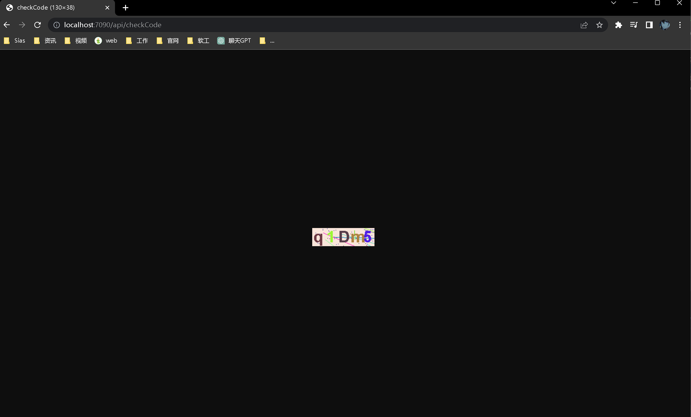

#### netdisk

### 项目介绍

---

在线网盘是一个前后端分离项目，项目采用 SpringBoot+Vue3 开发。

### 项目技术栈

#### 后端技术栈

1. Spring Boot
2. MyBatis
3. MySQL
4. Redis

####  前端技术栈

1. Vue
2. ElementUI
3. Bootstrap

### 项目功能

### 项目运行结果

### sql 文件

新建数据库 netdisk

```mysql
```


### Git commit 

生成验证码



