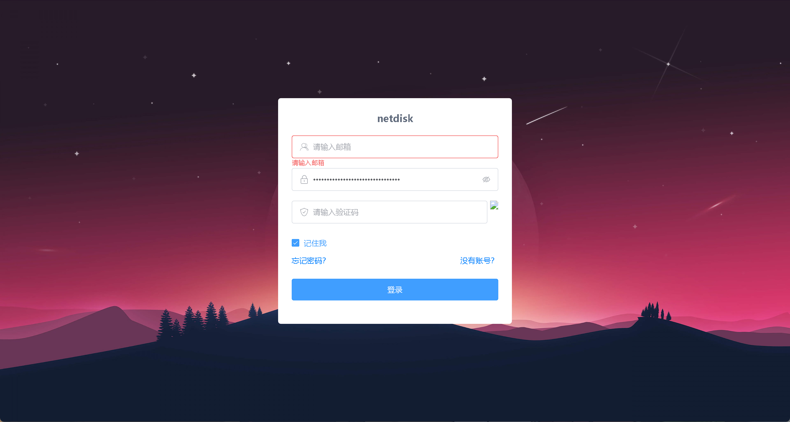
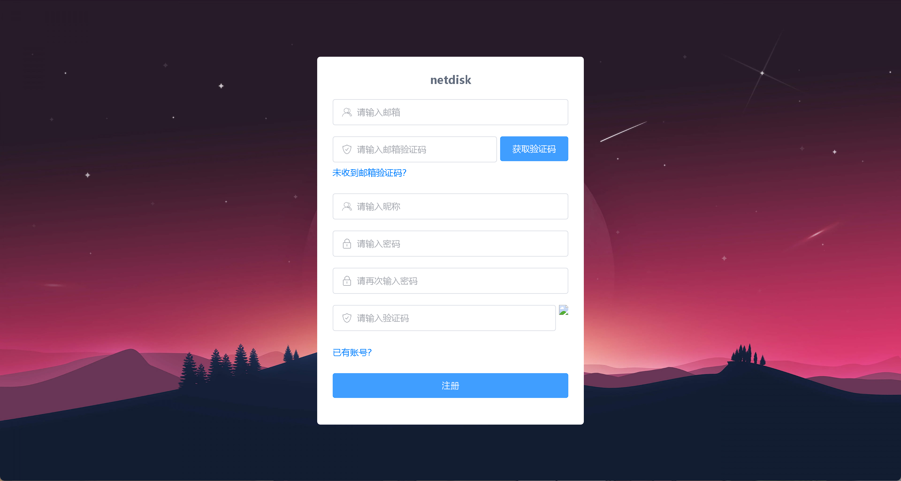

#### netdisk

### 项目介绍

---

在线网盘是一个前后端分离项目，项目采用 SpringBoot+Vue3 开发。

### 项目功能

文件上传（断点续传，秒传）

[百度 (快速体验文件上传)](http://fex.baidu.com/webuploader/getting-started.html) 

Github: [https://github.com/fex-team/webuploader](https://github.com/fex-team/webuploader)

文件分享

回收站

文件预览 （支持 .pdf .docx .xlsx .mkv 图片）

管理员功能

浏览用户文件

搜索用户 (添加空间，禁用用户)

登录注册

### 数据库

1. 新建数据库 netdist
2. 运行 SQL 文件 （在 netdiskserver/src/main/resources/netdisk.sql)
3. 修改 application.properties 中的数据库配置
