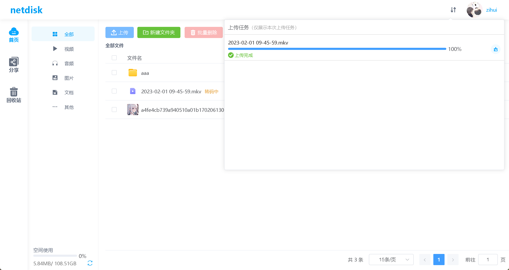
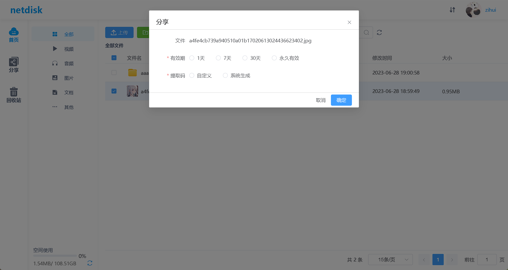
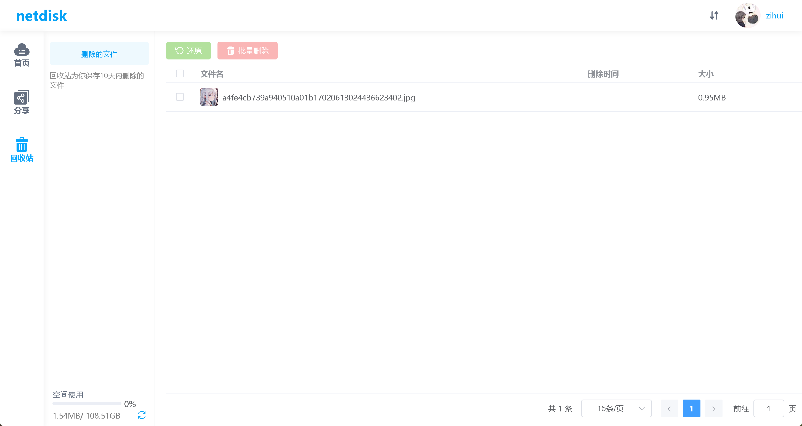
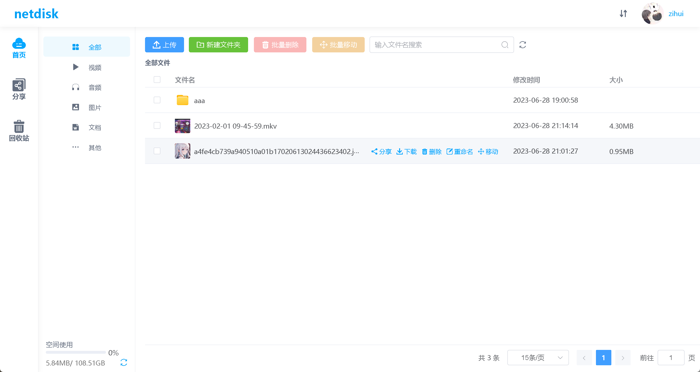
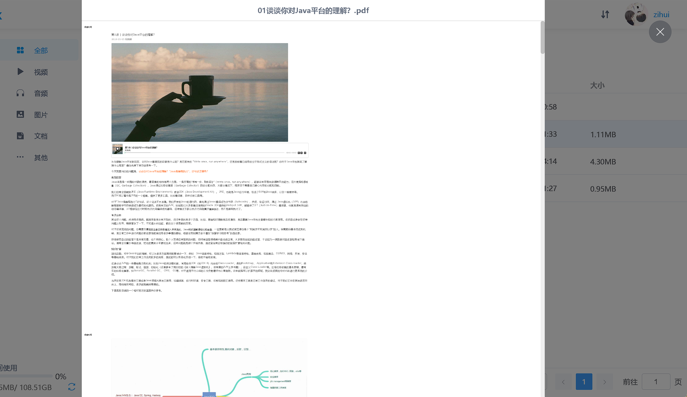
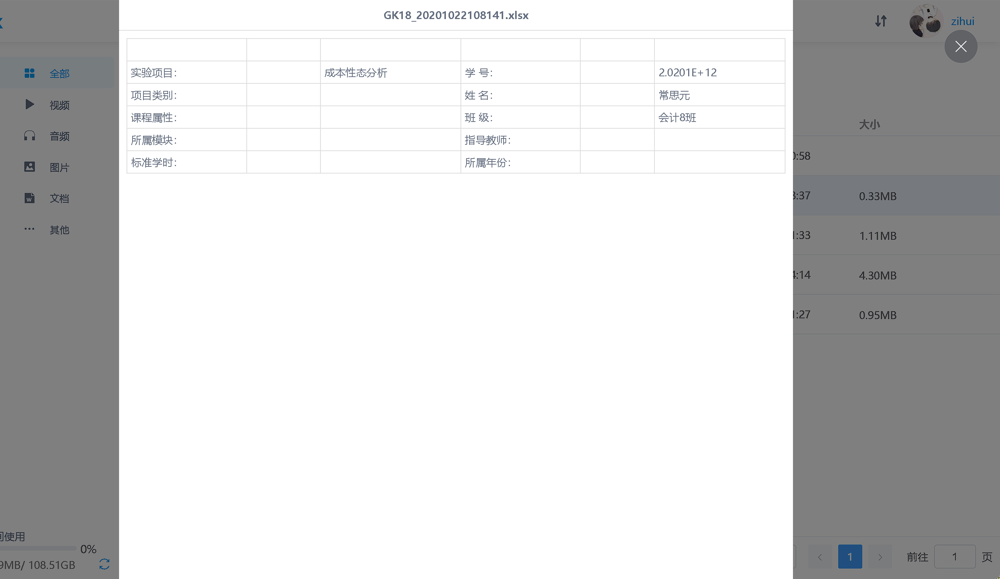
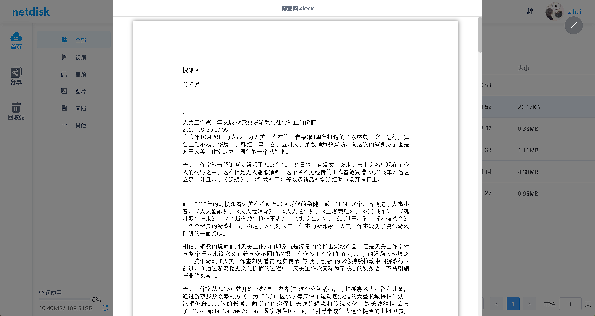
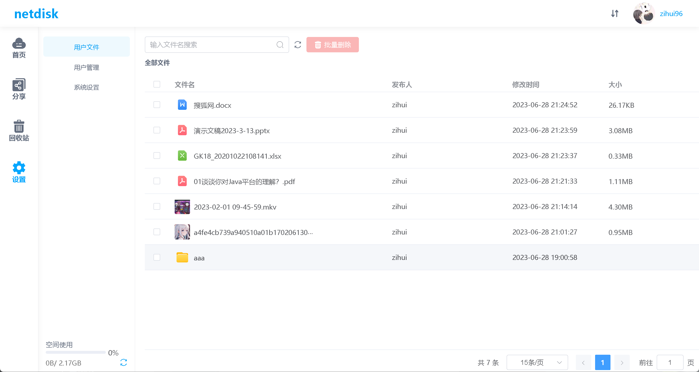
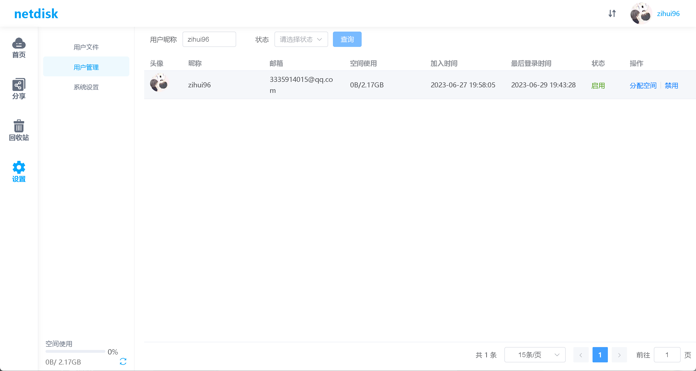

#### netdisk

### 项目介绍

---

在线网盘是一个前后端分离项目，项目采用 SpringBoot+Vue3 开发。

### 项目技术栈

#### 后端技术栈

1. Spring Boot
2. MyBatis
3. MySQL
4. Redis

####  前端技术栈

1. Vue

### 项目功能

登录注册

文件上传（断点续传，秒传）



[百度 (快速体验文件上传)](http://fex.baidu.com/webuploader/getting-started.html) 

Github: [https://github.com/fex-team/webuploader](https://github.com/fex-team/webuploader)

文件分享



回收站



文件预览 （支持 .pdf .docx .xlsx .mkv 图片）










管理员功能

浏览用户文件



搜索用户 (添加空间，禁用用户)



### sql 文件

新建数据库 netdisk

```mysql
create table netdisk.email_code
(
    email       varchar(150) not null,
    code        varchar(5)   not null comment '编号',
    create_time datetime     null,
    status      tinyint(1)   null comment '0 : 未使用 1 ： 已使用',
    primary key (email, code)
);

create table netdisk.file_info
(
    file_id          varchar(10)  not null comment '文件ID
',
    user_id          varchar(10)  not null comment '用户ID',
    file_md5         varchar(32)  null comment '文件MD5值',
    file_pid         varchar(10)  null comment '父级ID',
    file_size        bigint       null comment '文件大小',
    file_name        varchar(200) null comment '文件名',
    file_cover       varchar(100) null comment '封面',
    file_path        varchar(100) null comment '文件路径',
    create_time      datetime     null comment '创建时间',
    last_update_time datetime     null comment '最后更新时间',
    folder_type      tinyint(1)   null comment '0： 文件  1： 目录',
    file_category    tinyint(1)   null comment '文件分类： 1 ： 视频  2： 音频 3 ： 图片 4： 文档  5 ： 其他',
    file_type        tinyint(1)   null comment '1：视频 2：音频 3 ： 图片 4： 文档 5 ： doc  6 : excel   7：  txt  8： code   9： zip  10： 其他',
    status           tinyint(1)   null comment '0： 转码中 1： 转码失败 2 ： 转码成功',
    recovery_time    datetime     null comment '进入回收站时间',
    del_flag         tinyint(1)   null comment '标记删除： 0 ： 删除 1 ： 回收站 2 ： 正常',
    primary key (file_id, user_id)
);

create index idx_create_time
    on netdisk.file_info (create_time);

create index idx_del_flag
    on netdisk.file_info (del_flag);

create index idx_file_pid
    on netdisk.file_info (file_pid);

create index idx_md5
    on netdisk.file_info (file_md5);

create index idx_recovery_time
    on netdisk.file_info (recovery_time);

create index idx_status
    on netdisk.file_info (status);

create index idx_user_id
    on netdisk.file_info (user_id);

create table netdisk.file_share
(
    share_id    varchar(20) not null comment '分享ID'
        primary key,
    file_id     varchar(20) null comment '文件ID',
    user_id     varchar(20) null comment '分享人ID',
    valid_type  tinyint(1)  null comment '有效期类型 0： 1 天  1 ： 7 天   2 ： 30天  3 ：永久有效',
    expire_time datetime    null comment '失效时间',
    share_time  datetime    null comment '分享时间',
    code        varchar(5)  null comment '提取码',
    show_count  int         null comment '浏览次数'
);

create table netdisk.user_info
(
    user_id         varchar(15)  not null comment '用户ID'
        primary key,
    nick_name       varchar(20)  null comment '昵称',
    email           varchar(150) null comment '邮箱',
    qq_open_id      int          null comment 'qqOpenId',
    qq_avatar       varchar(150) null comment 'qq头像',
    password        varchar(32)  null comment '密码',
    join_time       datetime     null comment '加入时间',
    last_login_time datetime     null comment '最后登录时间',
    status          tinyint(1)   null comment '0 禁用 1 启用',
    use_space       bigint       null comment '使用空间单位',
    total_space     bigint       null comment '总空间',
    constraint key_email
        unique (email),
    constraint key_nick_name
        unique (nick_name),
    constraint key_qq_open_id
        unique (qq_open_id)
);
```

